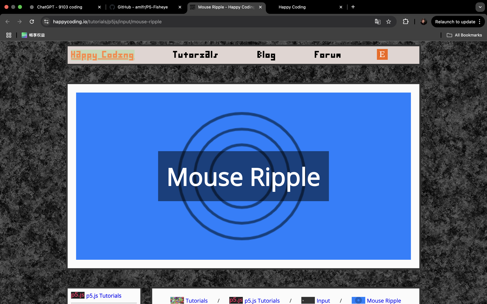

# Final-Project-Individual Functioning Prototype
**Github Repo**

For our group project, I decided to include mouse ripple effect as one of our animations.
After the page loads, simply move your mouse anywhere over the canvas and click once to create a set of three expanding concentric ripples. Each click instantly spawns rings that grow outward at a steady pace while their opacity fades until they disappear beyond the edges. There’s no play button or delay, each click triggers the animation in real time, and you can tap repeatedly to layer multiple ripples for a lively, interactive effect.

## 1. Animated Properties & Unique Features
**How to Interact**
- Click anywhere on the canvas to spawn three expanding concentric ripples.  
- Clicking a round pattern triggers it to rotate 90° and shrink to 1/2 in size.  
- Click on other patterns to restore the previous pattern to its original size, clicked one will repeat the shrinking process.
- Multiple clicks can layer ripples for a dynamic effect.  


### 1.1 Radius & Opacity: 
Each ripple is rendered as three concentric circles whose diameters increase by 10 px per frame, while their alpha channel fades from 255 down to 0 as they grow. 

### 1.2 Color Variation: 
On each click, three entirely random RGB colour will be generated from the tip of the mouse, making the ripple unique with its own palette.

### 1.3 Size Change:
Each individual pattern respond to mouse click by changing its size with rotating animation. 

### 1.4 Differentiation from Teammates: 
My individual animation is based on the action of mouseclick. The user input animation can be devided into two sections, the first one is creating a three layers ripple; the second is to trigger a shape shift, both is controlled using mouseclick. For our teammates, one teammate’s code cycles through Perlin-noise hues, another animates the shapes according to audio decibles. In contrast, my version layers expanding, shrinking, fading circles with random colors with click actions, emphasising immediate, click-driven bursts.


## 2. Inspiration References
The source code of mouse ripple is in reference to the Mouse Ripple from Happy Coding


P5.Js Example - Mouse Ripple (2021)

For the rotation animation, the inspiration came from a game called Cube Escape. In the 

[](https://youtu.be/lBb3_ZbDrCE)
Emi Sugar-Paisley (2024)

When clicking on each round pattern using mouse, the pattern will rotate and shrink to its 1/2 in size, in the meantime creating a set of ripple that gradually fades while expanding.

## 3. Technical Explanation

### 3.1 Immediately Invoked Function Expression (IIFE)
  ```js
  (function(){ … })();
  ```
To protect my coding from interfering other’s coding, with the assistance of Chat GPT, I introduced the function of IIFE into my programming. With IIFE, I was able to create a separate scope for variables, at the same time I can keep them from polluting the global scope. In the meantime, IIFE also contributes to perform an one time setup that I won't have to call the function multiple times when I write code.

### 3.2 Ripple Effect
The idea and base code are referenced from Happy Coding as mentioned above, to make the animation fits better into our project, several alterations were implemented.

**3.2.2 Comparisons Between The Original Code and the Altered Code**

|       **Dimension**      |                                                **Original Code**                                               |                                                             **Altered Version**                                                             |
| :----------------------: | :-------------------------------------------------------------------------------------------------------: | :--------------------------------------------------------------------------------------------------------------------------------------: |
|   **Structure & Scope**  | Everything in globals: `circleX`, `circleY`, `circleSize` + global `setup()`, `draw()`, `mousePressed()`. |   Wrapped in an IIFE defining a `UserInput` object; original `draw`/`mousePressed` saved to `_origDraw`/`_origMouse` and then extended.  |
|      **Data Model**      |                  Single circle tracked by three variables; each frame `circleSize += 10`.                 | Maintains a `circles` array; each click `push()`es an object `{x, y, size, colors}`; `updateAndDraw()` iterates and updates all ripples. |
|    **Visual Rendering**   |        Clears to a solid background; draws three fixed-blue concentric rings with uniform opacity.        |     Random RGB per ring; alpha mapped from 255→0 as ripples expand; filters out off-canvas ripples; stops with `noLoop()` when empty.    |
| **Interaction Behaviour** |                   `mousePressed()` moves the single circle’s center and resets its size.                  |          Override calls original `mousePressed()`, then adds a new ripple and calls `loop()` so drawing resumes for new ripples.         |


### 3.3 Easing
```js
current += (target - current) * 0.2;
```

To make values transition smoothly rather than jump abruptly, I use a easing formula in every frame. the setp was set by *0.2 of the remaining distance each frame for a smooth transformation. When getting closer to the target, the step size will shrink and therefore creating a natual fading effect.

#### Breakdown

1. **Compute the delta**
   ```js
   let delta = target - current;
   ```

   This is the signed distance remaining between the current value and where you want to be.

2. **Take a fraction of the delta**
   ```js
   let step = delta * 0.2;  // 20% of the remaining distance
   ```

   By moving only a fraction (here, 20%) of the gap each time, you create a simple smooth decay toward the target.

3. **Update the current value**
   ```js
   current += step;
   ```

   As `current` gets closer to `target`, `delta` shrinks, so the step you take also shrinks—naturally slowing the motion as it approaches its goal.

4. **Convergence and “snapping”**
   Floating-point math means you never truly reach the exact target, so after the difference falls below a tiny threshold (e.g. `Math.abs(delta) < 0.001`), you “snap” to the target and stop updating. This removes infinitesimal jitter at the end of the easing.


### Canvas Transforms (Localised Rotation & Scaling)
I aim to rotate and resize shapes around their own centre rather than the global origin (0,0), I chose to adapt p5.js’s transformation stack.  By using the following techniques, only intended shapes where transformed,also systematically manipulate the rotation function instead of manually recalciilate each time.

```js
push();                // 1. Save the current transformation state
translate(x, y);       // 2. Move the origin to the shape’s centre
rotate(angle);         // 3. Rotate the coordinate system by ‘angle’ radians
scale(scaleFactor);    // 4. Apply uniform scaling
drawShapeAtOrigin();   // 5. Draw your shape at (0,0)
pop();                 // 6. Restore the previous transformation state
```

#### Breakdown

1. **`push()`**

   * Captures the existing transformation matrix so any changes you make next won’t affect other drawings.

2. **`translate(x, y)`**

   * Shifts the origin to the exact point you want to treat as the pivot (usually the shape’s centre).

3. **`rotate(angle)`**

   * Spins the entire local coordinate axes around the new origin. Positive angles rotate clockwise in p5.js.

4. **`scale(s)`**

   * Enlarges (`s > 1`) or shrinks (`s < 1`) everything drawn afterwards, uniformly in both X and Y.

5. **`drawShapeAtOrigin()`**

   * Since you’ve moved and rotated the axes, you can draw your shape at `(0,0)` as if it were centred there, and it’ll appear in the correct world position, rotated and scaled.

6. **`pop()`**

   * Restores the transformation matrix saved by `push()`, so subsequent drawing calls start with a clean slate.


## Reference List
Emi Sugar-Paisley. (2024, March 20). @RustyLake Cube Escape: Arles- *Sunflower Puzzle&Key Tutorial* EASY SIMPLE Shortcut!! w/commentary. YouTube. https://www.youtube.com/watch?v=lBb3_ZbDrCE

p5.js Example - Mouse Ripple. (2021, January 10). Happy Coding. https://happycoding.io/tutorials/p5js/input/mouse-ripple

**AI Acknowledgment**
I acknowledge the use of AI in my tructure forming, language polishing and content managing.